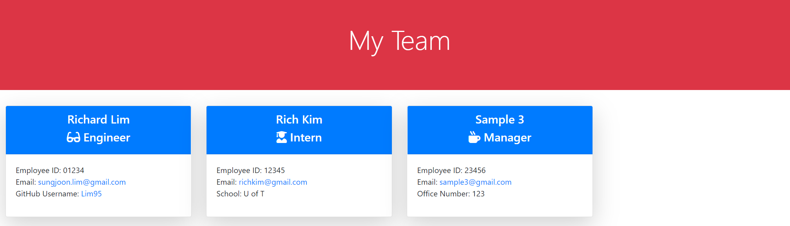

 
  # TEAM PORTFOLIO GENERATOR
  

  ## Description
  This application creates a webpage of a team portfolio from user input

  ## Table of Content
  * [ Installation ](#Installation)
  * [ Usage ](#Usage)
  * [ Contribution Guideline ](#Contribution-Guideline)
  * [ Tests ](#Tests)
  * [ Questions ](#Questions)
  * [ License ](#License)

  ## Installation
  You must download node.js, inquirer npm, email-validator before using this application. Also if you are using Windows, gitbash is also required. 

  ## Usage 
  Run 'node Index' at the root of your project and answer the prompted questions

  Click [here](https://drive.google.com/file/d/1hlX5pgyfC81CcPNuO4CJn0zFbs-EByNm/view) to see the functionality of the application.

  ### Screenshots
  
  
  ## Contribution Guideline
  [Contributor Covenant](https://www.contributor-covenant.org/version/2/0/code_of_conduct/)

  ## Tests
  `npm install jest --save-dev`

  Testing is done with jest and contains testing for all four classes, `Employee`, `Manager`, `Engineer` and `Intern`.

  ## Questions
  Contact the author with any questions! 
  Author: Richard Lim 
  Github link: [lim95](https://github.com/lim95) 
  Email address: sungjoon.lim@gmail.com

  ## License
  This project is [MIT](https://opensource.org/licenses/MIT) licensed. 
